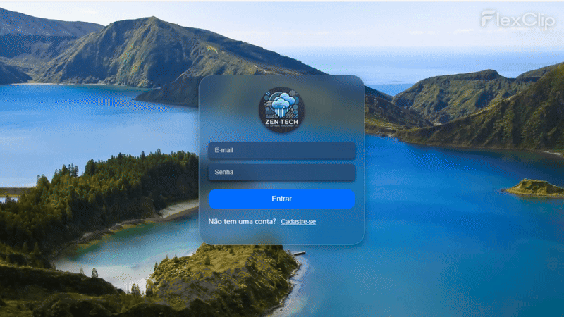
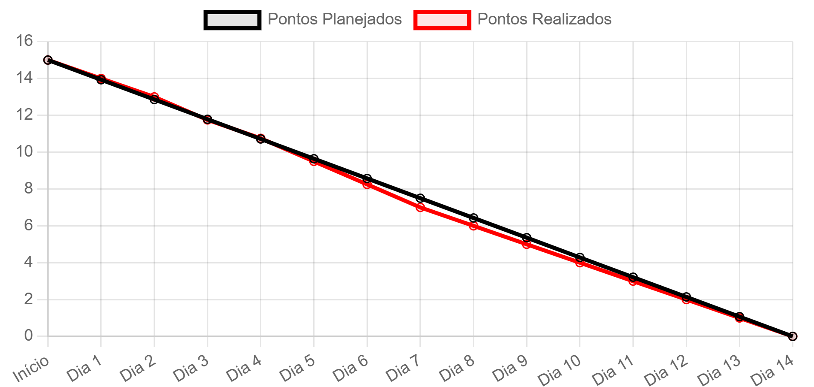

# Zen-Tech - Sprint 1

 

##### [🔝 Voltar ao topo ](#topo)

<h2 id="sprint">
Entregas de Sprints :
</h2>

Cada entrega foi realizada a partir da data definida com o cliente, com o relatório completo do que foi desenvolvido nas sprints. Abaixo está a relação das sprints:

| Sprint | Previsão de Entrega | Status | Histórico |
| ------ | -------------------- | ------ | --------- |
|   1    | 📅 15/04/2025        | :construction:  | [:round_pushpin: Ver Relatório]( ) |
|   2    | 📅 16/04/2025        | [-]  | [:round_pushpin: Ver Relatório]( ) |
|   3    | 📅 14/05/2025        | [-]  | [:round_pushpin: Ver Relatório]( ) |

Legenda:
- :white_check_mark: **Finalizada**
- :construction: **Em Progresso**
- [-] **Não iniciado**

A apresentação da Sprint 1 em vídeo por ser acessada por [aqui!]() 
 

<h3>Gif sprint 1:</h3>

 

##### [🔝 Voltar ao topo ](#topo)

<h2>
Backlog da Spint 1:
</h2>
  

   
|item  | Funcionalidade                     | Descrição                                                                                   | Prioridade |
|----------|------------------------------------|---------------------------------------------------------------------------------------------|------------|
|  | **WireFrame do projeto**           | Criar estrutura basica do projeto | ALTA
| RP01| **Protótipo (Figma)**              | Criar protótipo das principais telas (Login, Cadastro, Home e Gráficos).                     | ALTA       |
| RF01 | **Tela de Login**                  | Desenvolver tela de login e integrá-la com o back-end para autenticação.                     | ALTA       |
| RF01 | **Tela de Cadastro**               | Criar tela para cadastro de usuários com validação e integração com o back-end.              | ALTA       |
| RP02 | **Back-end – Autenticação**        | Implementar API de autenticação com Node.js, usando MongoDB e segurança (JWT).               | ALTA       |
|  | **Home Page – Front-end**          | Desenvolver home page com navegação para as outras funcionalidades.                        | MÉDIA      |
| RNF03 | **Página Explicativa**                      | Criar uma página com a explicação do projeto e seus objetivos.   | MÉDIA      |
| RNF01 | **Tela de Gráficos e Estatísticas**| Exibir dados meteorológicos em gráficos interativos.                | MÉDIA      |
| RP02 | **Infraestrutura Front-end**       | Configurar projeto React TypeScript, rotas e estrutura de componentes.                       | MÉDIA      |
| RP02 | **Documentação no Github**       | Criar documentação do projeto com grafico bundown e backlog                       | MÉDIA      |
| RF03 | **Gráficos de Parâmetros**                  | Mostrar gráficos interativos dos parâmetros de uma estação.    | ALTA       |
| RF04 | **Gráficos Comparativos**                   | Comparar o mesmo parâmetro entre diferentes estações.          | MÉDIA      |
| RF05 | **Download de Dados (CSV)**                 | Permitir a exportação dos dados em formato CSV.                | ALTA       |
  

##### [🔝 Voltar ao topo ](#topo)
 

  <h2>Burndown Sprint 01</h2>
  

 
 

| Função          | Nome                          | Links                                                                                                                         |
|-----------------|-------------------------------|-------------------------------------------------------------------------------------------------------------------------------|
| Project Owner   | Tiago Santini Da Silva     | <a href="https://github.com/TiagoSan77">Github</a>|
| Scrum Master    | Luana Pinheiro dos Santos Ve | <a href="">Github</a>|
| Dev Team        | Bruno Henrique Menezes Ramos | <a href="">Github</a> |
| Dev Team        | Vinicius Barbosa Fernandes    | <a href="">Github</a>|
| Dev Team        | Edlaine De Paula Souza | <a href="">Github</a>|
| Dev Team        | Caio Cesar Silva Azevedo dos Reis |<a href="">Github</a> |

