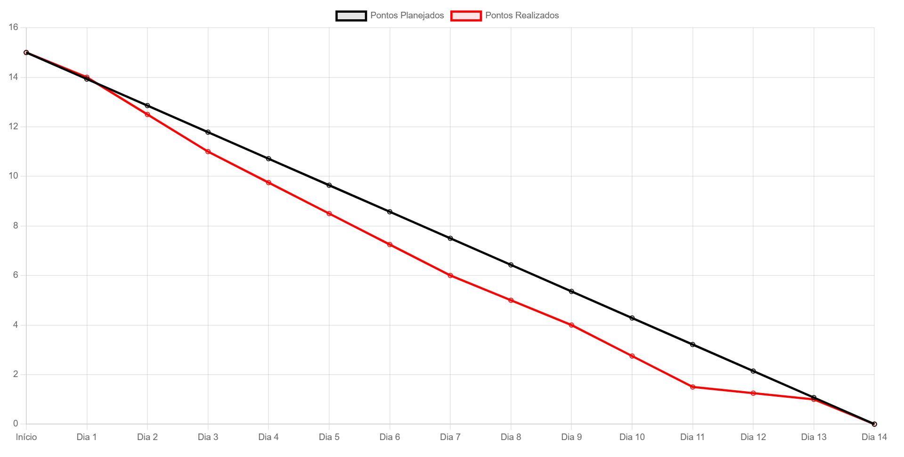

# Zen-Tech - Sprint 3

 

##### [🔝 Voltar ao topo ](#topo)

<h2 id="sprint">
Entregas de Sprints :
</h2>

Cada entrega foi realizada a partir da data definida com o cliente, com o relatório completo do que foi desenvolvido nas sprints. Abaixo está a relação das sprints:

| Sprint | Previsão de Entrega | Status | Histórico |
| ------ | -------------------- | ------ | --------- |
|   1    | 📅 15/04/2025        | :white_check_mark:| [:round_pushpin: Ver Relatório](./Sprint01.md) |
|   2    | 📅 16/04/2025        | 🚧  | [:round_pushpin: Ver Relatório](./Sprint02.md) 
|   3    | 📅 14/05/2025        | [-]  | [:round_pushpin: Ver Relatório]( ) |

Legenda:
- :white_check_mark: **Finalizada**
- :construction: **Em Progresso**
- [-] **Não iniciado**

A apresentação da Sprint 1 em vídeo por ser acessada por [aqui!]() 

 

##### [🔝 Voltar ao topo ](#topo)

  
<h2>Backlog da Sprint 3:</h2>

   
|item  | Funcionalidade                     | Descrição                                                                                   | Prioridade |
|----------|------------------------------------|---------------------------------------------------------------------------------------------|------------|
| RF03 | **Alerta de Clima**            | Exibir alertas de ventos e ondas e sinalizar o usuário quando os índices forem considerados altos e perigosos. | ALTA       |
| RNF03 | **Home-Page - Finalização**           | Finalização da Home-Page.                   | ALTA      |
| RP03 | **Tabelas - Criação da página**        | Criação da página de tabelas          | ALTA       |
|  | **Página de Gráficos - Finalização**          | Aprimorar design da página.                        | ALTA      |
| RF03 | **Histórico de Clima**            | Exibir registros históricos dos últimos 5 dias de cada estação em forma de tabela. | MÉDIA     |
| RNF03 | **Botão Sobre - Elemento informativo para cada página**| Explica como cada página funciona a partir da home´page.                | MÉDIA      |
| RP03 | **Documentação no Github**       | Criar documentação do projeto da Sprint 3 com grafico bundown e backlog                       | MÉDIA      |
  

##### [🔝 Voltar ao topo ](#topo)
 

| Função          | Nome                          | Links                                                                                                                         |
|-----------------|-------------------------------|-------------------------------------------------------------------------------------------------------------------------------|
| Project Owner   | Tiago Santini Da Silva     | <a href="https://github.com/TiagoSan77">Github</a>|
| Scrum Master    | Luana Pinheiro dos Santos Ve | <a href="">Github</a>|
| Dev Team        | Bruno Henrique Menezes Ramos | <a href="">Github</a> |
| Dev Team        | Vinicius Barbosa Fernandes    | <a href="">Github</a>|
| Dev Team        | Edlaine De Paula Souza | <a href="">Github</a>|
| Dev Team        | Caio Cesar Silva Azevedo dos Reis |<a href="">Github</a> |

  <h2>Burndown Sprint 03</h2>
  

